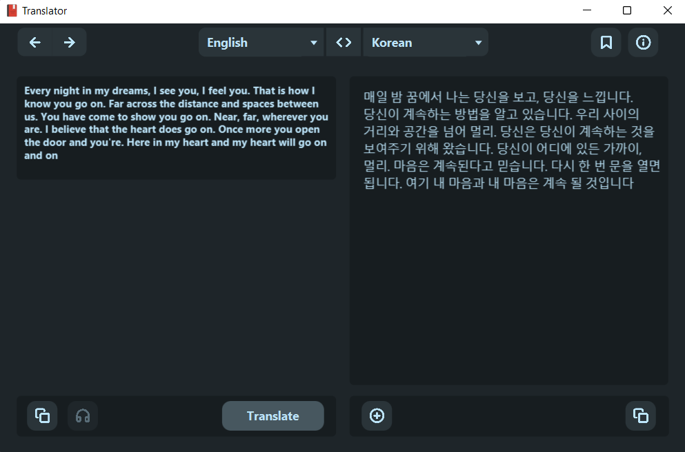

## OOP Project. UET-VNU

### Introduction

Dictionary Java project for UET-VNU OOP course. Online dictionary, multi-language support.

Contributor: [@hoangndst](https://github.com/hoangndst), [@naslth](https://github.com/naslth).

### Demo Image

- Translate Word: Type, Pronunciation, Definition, Synonym, Example and Audio in English.

    

- Translate Sentence

    

### Results obtained after calling Translate API

```json
{
  "sourceWord": "king",
  "source": "",
  "target": "vi",
  "targetWord": "nhà vua",
  "type": [
    "noun",
    "verb"
  ],
  "definition": [
    "the male ruler of an independent state, especially one who inherits the position by right of birth.",
    "make (someone) king."
  ],
  "example": [
    "King Henry VIII",
    null
  ],
  "synonyms": [
    [
      "ruler",
      "sovereign",
      "monarch",
      "supreme ruler",
      "crowned head",
      "majesty",
      "Crown",
      "head of state",
      "royal personage",
      "emperor",
      "prince",
      "potentate",
      "overlord",
      "liege lord",
      "lord",
      "leader",
      "chief"
    ],
    []
  ],
  "pronounce": "kɪŋ",
  "audio": "//ssl.gstatic.com/dictionary/static/sounds/20200429/king--1_gb_1.mp3"
}
```

### Libraries
- [JavaFX](https://openjfx.io/)
- [JFoenix](http://www.jfoenix.com/)

### License
[MIT](https://choosealicense.com/licenses/mit/)