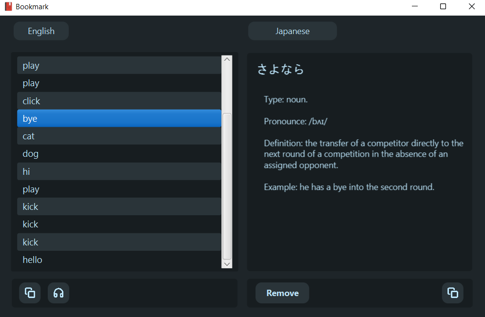
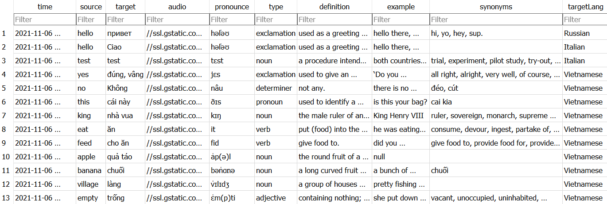

<br />
<div align="center">
  <a href="https://github.com/hoangndst/dictionary-java#readme">
    
  </a>

  <h3 align="center"><strong>Dictionary</strong></h3>

  <p align="center">
    Multiple languages dictionary. OOP Project. <a href="https://uet.vnu.edu.vn/"><strong>UET-VNU</strong></a>
    <br />
    <a href="https://github.com/hoangndst/dictionary-java#readme"><strong>Explore the docs</strong></a>
    <br />
    <a href="https://github.com/hoangndst/dictionary-java#readme">View Demo</a>
    ·
    <a href="https://github.com/hoangndst/dictionary-java/issues">Report Bug</a>
</div>


<details>
  <summary><strong>Table of Contents</strong></summary>
  <ol>
    <li>
      <a href="#introduction">Introduction</a>
    </li>
    <li>
      <a href="#demo-image">Demo Image</a>
      <ul>
        <li><a href="#translate-word">Translate Word</a></li>
        <li><a href="#translate-sentence">Translate Sentence</a></li>
        <li><a href="#bookmark">Bookmark</a></li>
      </ul>
    </li>
    <li><a href="#translate-api">Translate API</a></li>
    <li><a href="#database">Database</a></li>
    <li><a href="#libraries">Libraries</a></li>
    <li><a href="#license">License</a></li>
  </ol>
</details>
<br />

## Introduction

Dictionary Java project for UET-VNU OOP course. Online dictionary, multi-language support.


## Demo Image

### Translate Word
Type, pronunciation, definition, synonym, example and audio in English.


### Translate Sentence


### Bookmark
Add and remove bookmark.
One word can have multiple bookmark with different language.



### Edit Word
Edit word, pronunciation, definition, synonym, example, ... 


## Translate API 
Results obtained after calling Translate API

```json
{
  "sourceWord": "king",
  "source": "",
  "target": "vi",
  "targetWord": "nhà vua",
  "type": [
    "noun",
    "verb"
  ],
  "definition": [
    "the male ruler of an independent state, especially one who inherits the position by right of birth.",
    "make (someone) king."
  ],
  "example": [
    "King Henry VIII",
    null
  ],
  "synonyms": [
    [
      "ruler",
      "sovereign",
      "monarch",
      "supreme ruler",
      "crowned head",
      "majesty",
      "Crown",
      "head of state",
      "royal personage",
      "emperor",
      "prince",
      "potentate",
      "overlord",
      "liege lord",
      "lord",
      "leader",
      "chief"
    ],
    []
  ],
  "pronounce": "kɪŋ",
  "audio": "//ssl.gstatic.com/dictionary/static/sounds/20200429/king--1_gb_1.mp3"
}
```

## Database
### Bookmark data has been stored in SQLite database.

  Schema
  ``` sql
  CREATE TABLE "bookmark" (
	"time"	TEXT,
	"source"	TEXT,
	"target"	TEXT,
	"audio" TEXT,
	"pronounce"	TEXT,
	"type"	TEXT,
	"definition"	TEXT,
	"example"	TEXT,
	"synonyms"	TEXT,
	"targetLang"	TEXT
  );
  ```
  
  
### Quality offline data was imported from our own API.
  


## Libraries
- [JavaFX](https://openjfx.io/)
- [JFoenix](http://www.jfoenix.com/)

### Contributor: [@hoangndst](https://github.com/hoangndst), [@naslth](https://github.com/naslth).

## License
[MIT](https://choosealicense.com/licenses/mit/)
